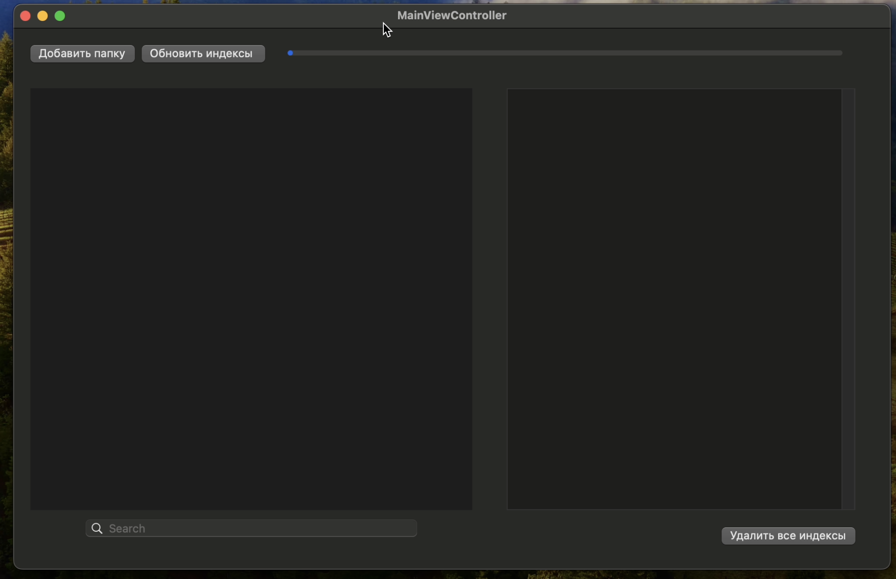
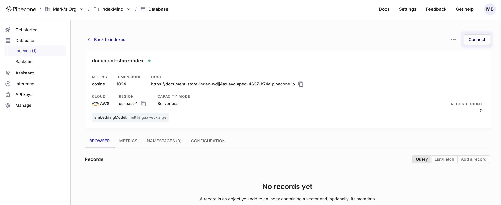
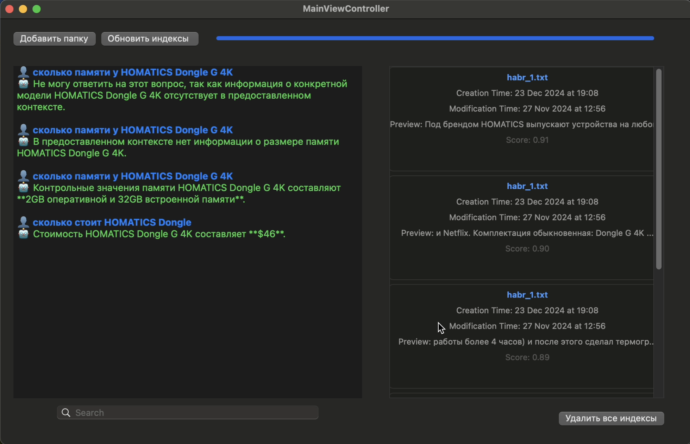
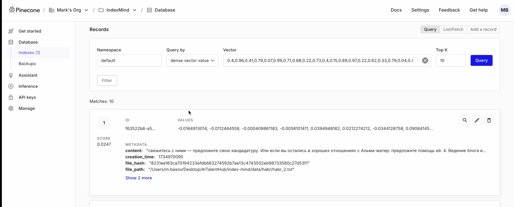
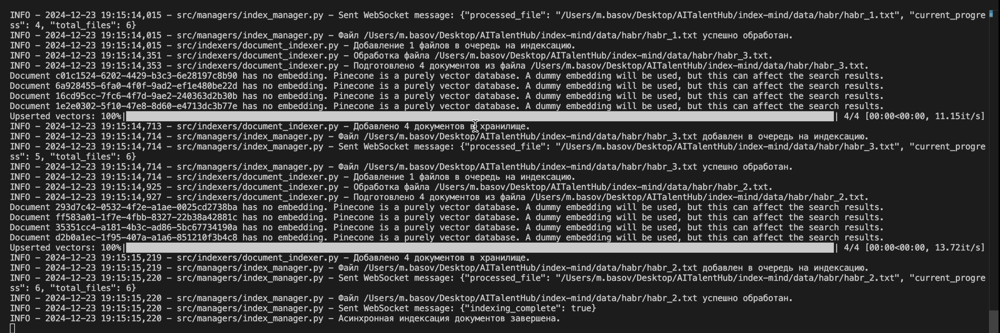

# IndexMind

> Интеллектуальная система локального поиска с использованием RAG и векторных индексов

IndexMind представляет собой передовое решение для семантического поиска по локальным данным, использующее технологии Retrieval-Augmented Generation (RAG) и векторное индексирование FAISS.

## 🚀 Основные возможности

- **Локальная индексация и безопасность**: Данные остаются на вашем устройстве, что гарантирует максимальную защиту и приватность информации.
- **Умный анализ документов**: Поддержка текстовых форматов (DOC, MD, TXT) и PDF файлов с автоматическим отслеживанием изменений по хэшам.
- **Эффективная индексация**: Система автоматически отслеживает изменения в файлах и обновляет индекс при модификации документов.
- **Инкрементальная индексация**: Постепенное добавление новых данных без необходимости пересоздания всего индекса, сохраняйте высокую производительность даже с большими объемами.
- **Нативное macOS приложение**: Оптимизированный интерфейс для максимального удобства работы на Mac.

## 📋 Техническое описание

### Архитектура
- **Frontend**: macOS нативное приложение
- **Backend**: Python FastAPI
- **Индексация**: FAISS векторное хранилище
- **ML**: Интеграция с Hugging Face моделями

### Процесс работы
1. **Добавление контента**
   - Выбор файлов через стандартный диалог macOS
   - Поддержка форматов: DOC, MD, TXT, PDF
   - Автоматическое отслеживание изменений по хэшам

2. **Индексация**
   - Автоматическая переиндексация при изменениях
   - Инкрементальные обновления
   - Сохранение метаданных (временные метки, позиции чанков)

3. **Поиск**
   - Семантический поиск по содержимому
   - Контекстные ответы на основе RAG
   - Точность поиска ~80% (валидация на статьях Хабр)

## 📸 Скриншоты

## 📱 Контакты

**Разработчик**: Марк Басов
**Email**: basovmark@gmail.com
**GitHub**: [IndexMind Repository](https://github.com/yourusername/indexmind)
