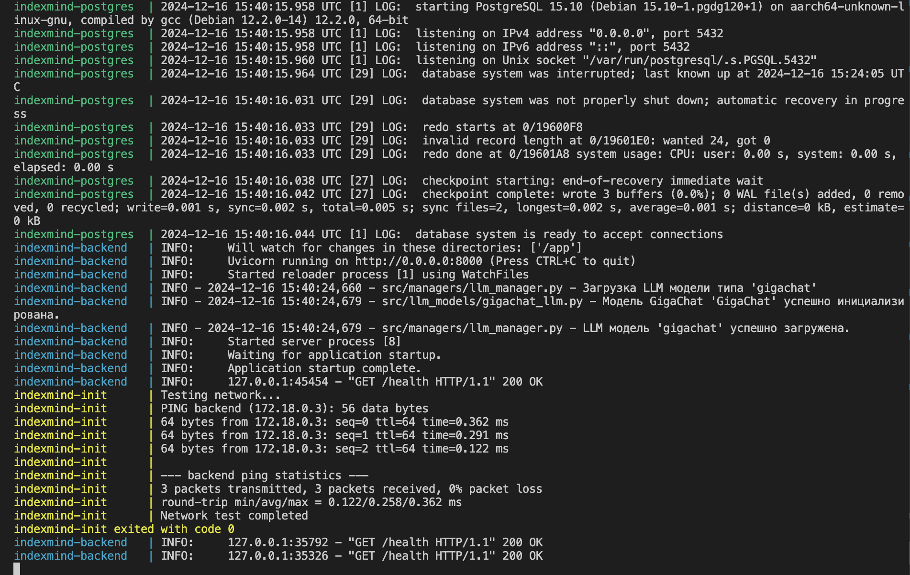

# docker-compose

В компоузе три сервиса:

- **init**: сервис для проверки сетевой доступности `backend` и `postgres`. Запускается после полной развертки всего остального.
- **postgres**: постгря с портом 5432. Запускается первая
- **backend**: бэкенд на Python. Открывает коммуникации на порту 8000. Запускается после постгри.

- Используется общий `network` для взаимодействия между сервисами.
- Сервисам назначены `healthcheck` для проверки их готовности.
- Примонтирован вольюм для хранения данных PostgreSQL и данных приложения.

## Ответы на вопросы

   1. Ограничения ресурсов задаются через директиву `deploy.resources` (cpus и memory).
   2. Для запуска отдельного сервиса используйте `docker-compose up <имя_сервиса>` (`docker-compose up backend`). `--no-deps` - для исключения depends_on зависимостей :

