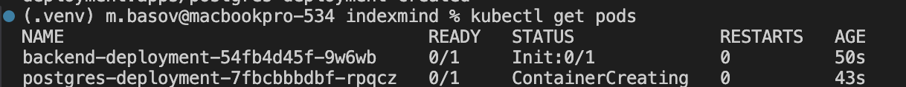
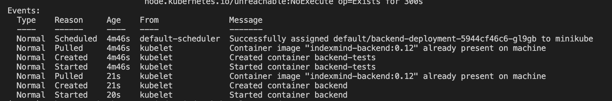
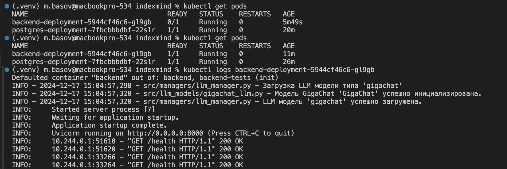
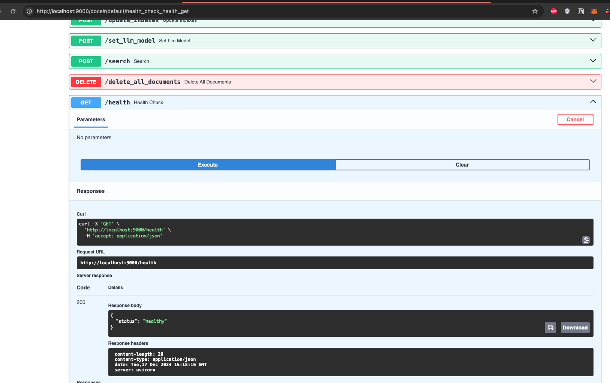

# k8s-additionals

начал с докерфайла решил его почистить потому что было много лишнего
в основном убрал все что в кубере будет по другому:
- хелсчеки заменю на пробы
- тесты перенесу в инит контейнер
- вольюмы будут через pvc

## ход работы

собрал образ и закинул в миникуб:
`docker build -t indexmind-backend:0.11 ./indexmind/backend`
`minikube image load indexmind-backend:0.11`

зашел в миникуб почистить все старье и сделать папки для данных (типа PVC, в будущем это будет s3):
`minikube ssh`
снес старые образы:
`docker images && docker rmi <several_outdated_backend_images>`

создал папки для данных:
```(bash)
sudo mkdir -p /data/backend
sudo chmod 777 /data/backend
sudo mkdir -p /data/postgres
sudo chmod 777 /data/postgres
exit
```

полная чистка:
`kubectl get pods` + удалить все
> No resources found in default namespace.
`kubectl get services` + удалить все
> kubernetes   ClusterIP   10.96.0.1    <none>        443/TCP   5h13m (только системный сервис)
то же самое с секретами и конфигмапами

начал с секретов:
`kubectl apply -f secret-backend.yaml && kubectl apply -f secret-postgres.yaml`
> secret/backend-secret created
> secret/postgres-secret created

создал сервисы:
`kubectl apply -f service-postgres.yaml`
> service/postgres-service created
`kubectl apply -f service-backend.yaml`
> service/backend-service created

создал деплойменты:
`kubectl apply -f deployment-backend.yaml`
> persistentvolume/local-backend-pv created
> persistentvolumeclaim/local-backend-pvc created
> deployment.apps/backend-deployment created

`kubectl apply -f deployment-postgres.yaml`
> persistentvolume/local-postgres-pv created
> persistentvolumeclaim/local-postgres-pvc created
> deployment.apps/postgres-deployment created

`kubectl get pods`


`kubectl describe pod backend-deployment-54fb4d45f-ptzfw`


`kubectl get pods`


чтоб зайти посмотреть:
`kubectl port-forward service/backend-service 9000:9000`
> Forwarding from 127.0.0.1:9000 -> 8000
> Forwarding from [::1]:9000 -> 8000
> Handling connection for 9000


грац, на этом все
