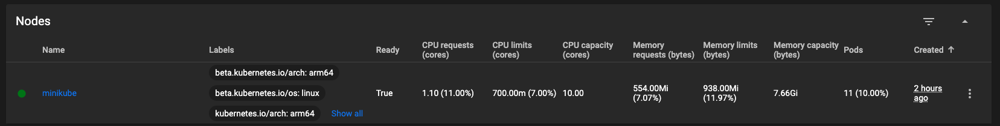
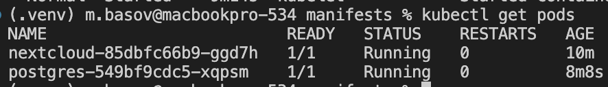
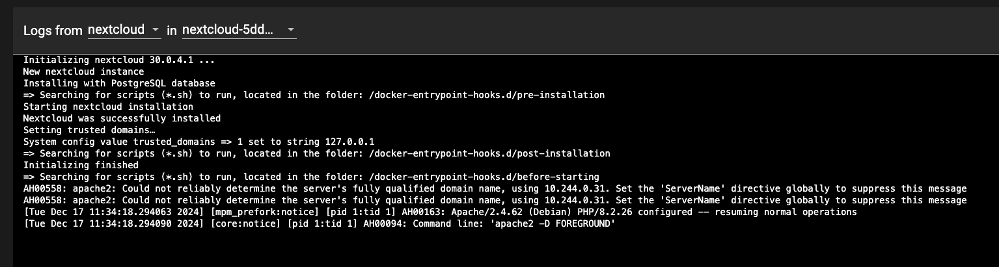
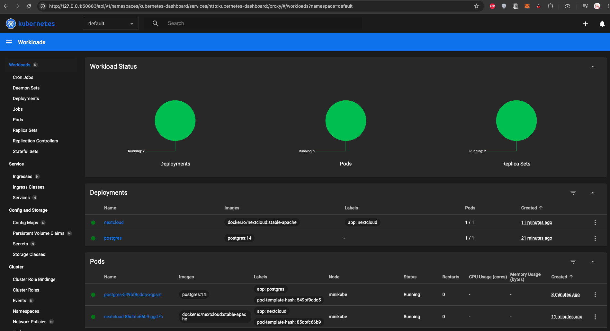
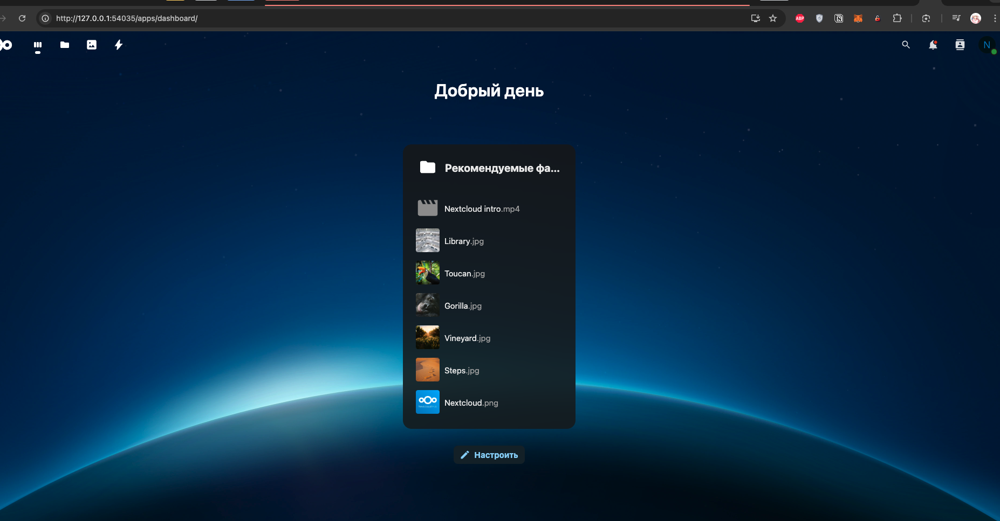
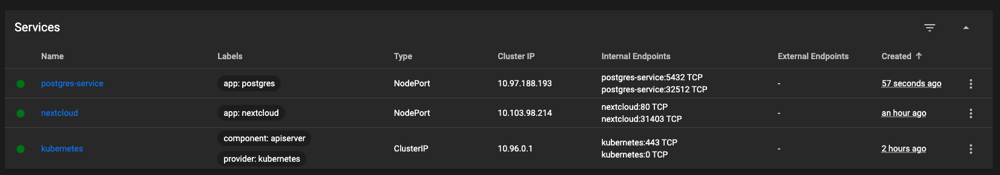
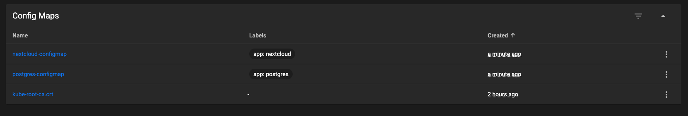
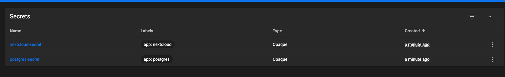
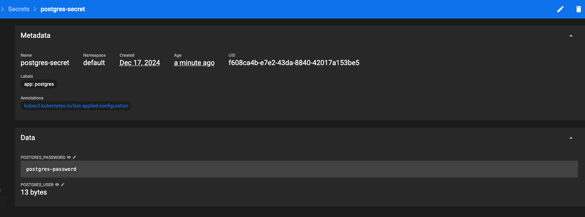
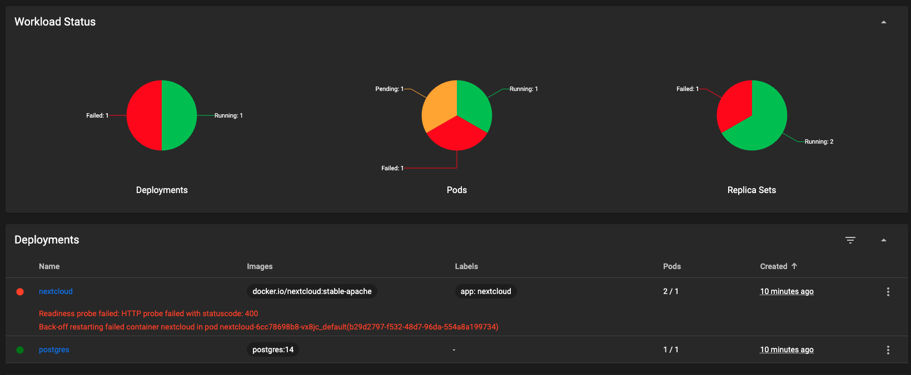

# k8s

> Вопрос: важен ли порядок выполнения этих манифестов? Почему?

Важно первым делом конфигмапу создать, потому что деплоймент на нее ссылается в env_from.
Деплоймент или сервис, что раньше? В целом, без разницы, сервису необязательно иметь запущенный под деплоймента, а деплоймент
без сервиса будет спокойно жить, только к нему будет никак не подстучаться. Можно и так и так, я запускал сначала деплоймент, потом сервис.

> Вопрос: что (и почему) произойдет, если отскейлить количество реплик postgres-deployment в 0, затем обратно в 1, после чего попробовать снова зайти на Nextcloud?

`Internal Server Error`  - видимо по причине временного нахождения postgres с 0 репликами, лучше не допускать таких сценариев (Nextcloud может иметь устаревший кэш, который вызывает сбой).
`kubectl delete -f nextcloud.yml && kubectl apply -f nextcloud.yml` - помогает, значит проблема именно в кэшах, а не в постгресе.

## скрины работы

UI кубера намного удобнее, чем консоль..

можно посмотреть пароль в секрете )

Error while trying to initialise the database: An exception occurred while executing a query: SQLSTATE[42501]: Insufficient privilege: 7 ERROR:  permission denied for table oc_migrations
